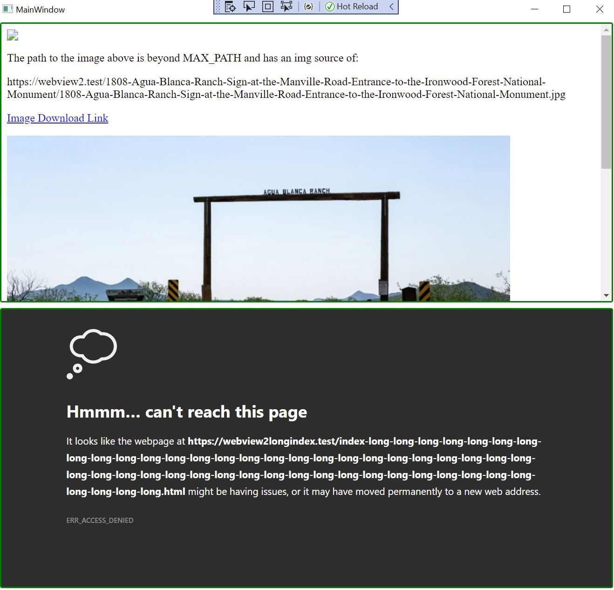

# Win10 - WebView2 - WPF - Virtual Host Name Path Length Problem Test

Using [SetVirtualHostNameToFolderMapping](https://docs.microsoft.com/en-us/dotnet/api/microsoft.web.webview2.core.corewebview2.setvirtualhostnametofoldermapping?view=webview2-dotnet-1.0.864.35) with WebView2 allows you to map a virutal host name to a folder path.

This seems like an excellent way to preview content but at present it doesn't seem to support long file paths on Windows - this repo is a quick test of that created in part to help me confirm all the details.

To check this repo out on Windows you will have to set the core.longpaths true HOWEVER you might want to see [git/core.txt at d003d728ffa6c0006da875ec6318d3f6b28a4ddb · git-for-windows/git](https://github.com/git-for-windows/git/blob/d003d728ffa6c0006da875ec6318d3f6b28a4ddb/Documentation/config/core.txt#L560-L565) for some potential downfalls. (If you are using GitHub desktop running 'git config --global core.longpaths true' - for GitHub Desktop I found the sometimes recommended --system did not help for GitHub Desktop.)

Directly related to this issues are [Maximum Path Length Limitation - Win32 apps | Microsoft Docs](https://docs.microsoft.com/en-us/windows/win32/fileio/maximum-file-path-limitation?tabs=cmd) and [Naming Files, Paths, and Namespaces - Win32 apps | Microsoft Docs](https://docs.microsoft.com/en-us/windows/win32/fileio/naming-a-file?redirectedfrom=MSDN#maxpath).

Things tried:
 - Use group policy to enable the newer Win10 behavior that removes the MAX_PATH limitations -> Computer Configuration > Administrative Templates > System > Filesystem > Enable Win32 long paths.
 - Use the \\\\?\\ prefix in the call to SetVirtualHostNameToFolderMapping
 - Add an application manifest with:

```xml
    <application xmlns="urn:schemas-microsoft-com:asm.v3">
        <windowsSettings xmlns:ws2="http://schemas.microsoft.com/SMI/2016/WindowsSettings">
            <ws2:longPathAware>true</ws2:longPathAware>
        </windowsSettings>
    </application>
```

Reported this in the [Feedback repo for Microsoft Edge WebView2](https://github.com/MicrosoftEdge/WebView2Feedback) as [Long File Paths result in Broken Content when using SetVirtualHostNameToFolderMapping · Issue #1573 · MicrosoftEdge/WebView2Feedback](https://github.com/MicrosoftEdge/WebView2Feedback/issues/1573).



The screen shot above is from the sample app and shows:
 - In the top panel the source is set to an html file that is below MAX_PATH value and loads, but the top image is a link to a file beyond the MAX_PATH - the error is: Failed to load resource: net::ERR_ACCESS_DENIED (the top panel also includes some other working content as a sanity check)
 - In the bottom panel the source is set to a file with a long enough name to be over the MAX_PATH and it fails to load
